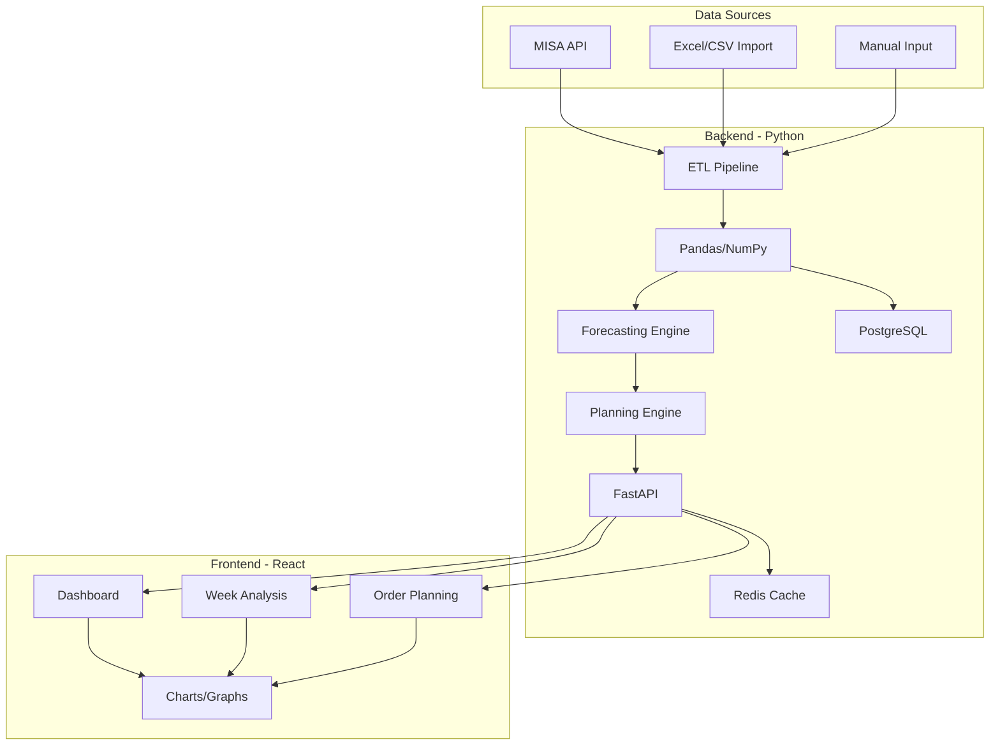
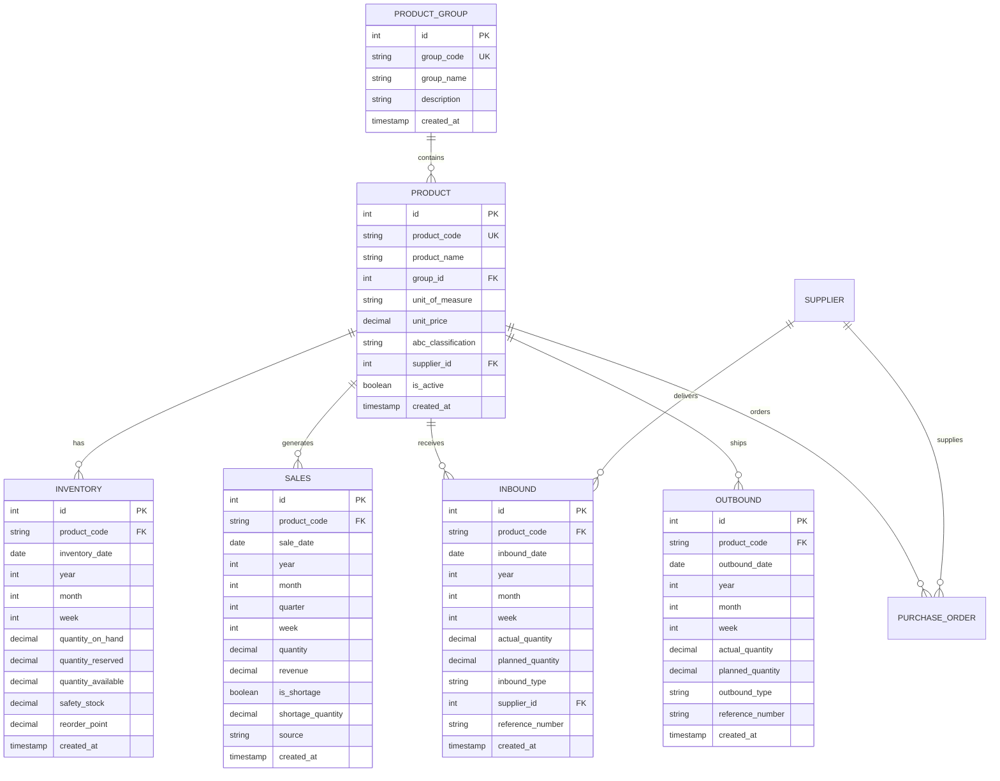
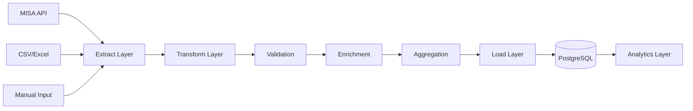

# HỆ THỐNG INVENTORY PLANNING & FORECASTING
## Tài liệu Phân tích & Thiết kế Chi tiết

**Version:** 1.0  
**Date:** December 28, 2025  
**Industry:** POS, F&B  
**Stack:** Python Backend + React Frontend

---

## MỤC LỤC

1. [Tổng quan dự án](#1-tổng-quan-dự-án)
2. [Phân tích yêu cầu nghiệp vụ](#2-phân-tích-yêu-cầu-nghiệp-vụ)
3. [Kiến trúc hệ thống](#3-kiến-trúc-hệ-thống)
4. [Database Design](#4-database-design)
5. [Business Logic](#5-business-logic)
6. [Data Pipeline & ETL](#6-data-pipeline--etl)
7. [Forecasting Models](#7-forecasting-models)
8. [Planning Engine](#8-planning-engine)
9. [API Specifications](#9-api-specifications)
10. [Frontend Design](#10-frontend-design)
11. [Implementation Guide](#11-implementation-guide)
12. [Testing Strategy](#12-testing-strategy)
13. [Deployment](#13-deployment)

---

## 1. TỔNG QUAN DỰ ÁN

### 1.1. Mục tiêu

Xây dựng hệ thống **Inventory Planning & Forecasting** để:
- Phân tích dữ liệu nhập/xuất/tồn kho theo tuần và tháng
- Dự báo nhu cầu (demand forecasting) với độ chính xác cao
- Tự động tính toán Safety Stock, Reorder Point, Order Quantity
- Tạo kế hoạch đặt hàng tối ưu với NCC
- Cảnh báo tình trạng thiếu hàng và ordering windows

### 1.2. Phạm vi

**Input:**
- Dữ liệu tồn đầu kỳ (API MISA / Import CSV/Excel)
- Phiếu nhập kho (Thực nhập + Dự trù)
- Phiếu xuất bán hàng (Thực xuất + Dự trù)
- Thông tin nhà cung cấp và lead time
- Seasonal factors và external factors

**Output:**
- Báo cáo phân tích theo tuần (WEEK sheet)
- Kế hoạch đặt hàng (ORDER sheet)
- Biểu đồ và dashboard phân tích
- Alerts và recommendations

### 1.3. Định nghĩa tuần

Theo yêu cầu từ file `PhanTich_PP.txt`:
- **Tuần 1:** Ngày 1-7
- **Tuần 2:** Ngày 8-14
- **Tuần 3:** Ngày 15-21
- **Tuần 4:** Ngày 22 - Cuối tháng

### 1.4. Tồn kho an toàn

**Safety Stock = 3 tháng** (theo yêu cầu)

**Lead Time Gap = 4 tháng 3 tuần** (≈ 19 tuần)

---

## 2. PHÂN TÍCH YÊU CẦU NGHIỆP VỤ

### 2.1. Sheet WEEK - Phân tích theo tuần

#### 2.1.1. Cấu trúc dữ liệu

```
Mã | Mã hàng | C4I/thùng | Tồn đầu | [Tuần 1-4] | Tồn cuối
```

Mỗi tuần có:
- **Nhập:** Thực nhập, Dự trù
- **Xuất:** Thực xuất, Dự trù
- **Tồn cuối:** Tồn đầu + Nhập - Xuất

#### 2.1.2. Business Rules

**Rule 1: Priority của dữ liệu nhập**
```
IF có "Thực nhập" THEN
    Dùng "Thực nhập" để tính tồn cuối
    Bỏ qua "Dự trù"
ELSE
    Dùng "Dự trù" để tính tồn cuối
END IF
```

**Rule 2: Kết chuyển tồn kho**
```
Tồn cuối Tuần N = Tồn đầu Tuần N+1
Tồn cuối Tuần 4 Tháng N = Tồn đầu Tuần 1 Tháng N+1
```

**Rule 3: Xử lý hàng về trễ**
```
IF hàng dự trù về trễ THEN
    Move giá trị sang tuần/tháng thực tế dự kiến về
END IF
```

**Rule 4: Xử lý hàng trả lại**
```
Hàng bán bị đổi trả → Nhập lại kho → Cộng vào tồn cuối
```

#### 2.1.3. Nguồn dữ liệu

| Dữ liệu | Nguồn | Format |
|---------|-------|--------|
| Nhóm hàng | API MISA | JSON |
| Hàng hóa + ĐVT | API MISA | JSON |
| Tồn đầu | API MISA / Import | CSV/Excel/JSON |
| Nhập kho | Phiếu nhập (MISA) | JSON |
| Xuất kho | Phiếu xuất (MISA) | JSON |
| Dự trù nhập | Planning trước đó | Excel |
| Dự trù xuất | Forecast | Calculated |

### 2.2. Sheet ORDER - Kế hoạch đặt hàng

#### 2.2.1. Mục đích

Tạo Purchase Order dựa trên:
- Forecast 12 tháng
- Safety stock requirements
- Seasonal factors
- Lead time từ NCC

#### 2.2.2. Thông tin cần có

- Qui cách đầu tháng (Opening inventory)
- SL Bán TB (Average monthly sales)
- CL Tồn kho theo dự trù (Target inventory)
- SL đặt bán cho 7 tháng
- Timing đặt hàng

#### 2.2.3. Seasonal Adjustments

Theo phân tích ban đầu:

**Q2 (Tháng 3-5):** +25% so với TB
- Mùa nông nghiệp
- Khách mua nhiều

**Q4 (Tháng 9-11):** +30% so với TB
- Mùa vụ thu đông
- Chạy Promotion
- Tháng 12: Peak (+35%) - dự trữ Tết

**Q1, Q3:** Duy trì bình thường (100%)

### 2.3. Sheet Biểu đồ - Analytics

Dashboard bao gồm:
- Trend analysis (12 tháng)
- Seasonal decomposition
- ABC classification
- Stock coverage analysis
- Forecast vs Actual comparison
- Supplier performance

### 2.4. Sheet Planning - Factors

Các yếu tố tác động:

#### NCC (Suppliers)
- **T2:** Nghỉ Tết (20-30 ngày delay)
- **T7-8:** Thời tiết nóng → Sản xuất chậm (+7-10 ngày)
- **T10-12:** Cao điểm + Thời tiết lạnh → Sản xuất chậm (+10-14 ngày)

#### FWD (Forwarding/Shipping)
- **T6-7:** Kẹt tàu, cước cao
- **T11-12:** Kẹt tàu cuối năm, cước cao

#### KH (Customers)
- **T3-5:** Mùa nông nghiệp → Tăng 25%
- **T9-11:** Mùa thu đông → Tăng 30%
- **T12:** Dự trữ Tết → Peak

---

## 3. KIẾN TRÚC HỆ THỐNG

### 3.1. High-Level Architecture



### 3.2. Technology Stack

#### Backend
- **Framework:** FastAPI (Python 3.11+)
- **Data Processing:** Pandas, NumPy
- **Forecasting:** 
  - statsmodels (SARIMA)
  - Prophet (Facebook)
  - LightGBM (ML approach)
- **Database:** PostgreSQL 15
- **Cache:** Redis 7
- **Background Tasks:** Celery
- **API Documentation:** Swagger/OpenAPI

#### Frontend
- **Framework:** React 18 + TypeScript
- **State Management:** Redux Toolkit / Zustand
- **Charts:** Recharts, Plotly.js
- **UI Library:** Tailwind CSS + shadcn/ui
- **Data Grid:** AG-Grid / TanStack Table
- **API Client:** Axios

#### DevOps
- **Containerization:** Docker + Docker Compose
- **CI/CD:** GitHub Actions
- **Monitoring:** Prometheus + Grafana
- **Logging:** ELK Stack (Elasticsearch, Logstash, Kibana)

---

## 4. DATABASE DESIGN

### 4.1. Schema Overview



### 4.2. Table Definitions (SQL)

```sql
-- ============================================
-- 1. PRODUCT GROUP
-- ============================================
CREATE TABLE product_groups (
    id SERIAL PRIMARY KEY,
    group_code VARCHAR(50) UNIQUE NOT NULL,
    group_name VARCHAR(200) NOT NULL,
    description TEXT,
    created_at TIMESTAMP DEFAULT CURRENT_TIMESTAMP,
    updated_at TIMESTAMP DEFAULT CURRENT_TIMESTAMP
);

CREATE INDEX idx_product_groups_code ON product_groups(group_code);

-- ============================================
-- 2. SUPPLIERS
-- ============================================
CREATE TABLE suppliers (
    id SERIAL PRIMARY KEY,
    supplier_code VARCHAR(50) UNIQUE NOT NULL,
    supplier_name VARCHAR(200) NOT NULL,
    country VARCHAR(100),
    base_lead_time_days INT DEFAULT 120,
    reliability_score DECIMAL(3,2) CHECK (reliability_score BETWEEN 0 AND 1),
    is_active BOOLEAN DEFAULT TRUE,
    created_at TIMESTAMP DEFAULT CURRENT_TIMESTAMP,
    updated_at TIMESTAMP DEFAULT CURRENT_TIMESTAMP
);

-- ============================================
-- 3. PRODUCTS
-- ============================================
CREATE TABLE products (
    id SERIAL PRIMARY KEY,
    product_code VARCHAR(50) UNIQUE NOT NULL,
    product_name VARCHAR(200) NOT NULL,
    group_id INT REFERENCES product_groups(id),
    unit_of_measure VARCHAR(20),
    units_per_carton INT,
    unit_price DECIMAL(18,2),
    abc_classification VARCHAR(1) CHECK (abc_classification IN ('A','B','C','D')),
    supplier_id INT REFERENCES suppliers(id),
    is_active BOOLEAN DEFAULT TRUE,
    must_maintain_stock BOOLEAN DEFAULT FALSE,
    created_at TIMESTAMP DEFAULT CURRENT_TIMESTAMP,
    updated_at TIMESTAMP DEFAULT CURRENT_TIMESTAMP
);

CREATE INDEX idx_products_code ON products(product_code);
CREATE INDEX idx_products_group ON products(group_id);
CREATE INDEX idx_products_abc ON products(abc_classification);

-- ============================================
-- 4. OPENING INVENTORY
-- ============================================
CREATE TABLE opening_inventory (
    id SERIAL PRIMARY KEY,
    product_code VARCHAR(50) REFERENCES products(product_code),
    inventory_date DATE NOT NULL,
    year INT NOT NULL,
    month INT NOT NULL,
    quantity DECIMAL(18,2) NOT NULL,
    source VARCHAR(50), -- 'MISA_API', 'IMPORT', 'MANUAL'
    created_at TIMESTAMP DEFAULT CURRENT_TIMESTAMP,
    UNIQUE(product_code, year, month)
);

CREATE INDEX idx_opening_inv_product ON opening_inventory(product_code);
CREATE INDEX idx_opening_inv_date ON opening_inventory(year, month);

-- ============================================
-- 5. INBOUND (Nhập kho)
-- ============================================
CREATE TABLE inbound (
    id SERIAL PRIMARY KEY,
    product_code VARCHAR(50) REFERENCES products(product_code),
    inbound_date DATE NOT NULL,
    year INT NOT NULL,
    month INT NOT NULL,
    week INT NOT NULL CHECK (week BETWEEN 1 AND 4),
    actual_quantity DECIMAL(18,2),
    planned_quantity DECIMAL(18,2),
    inbound_type VARCHAR(20), -- 'ACTUAL', 'PLANNED'
    supplier_id INT REFERENCES suppliers(id),
    po_number VARCHAR(50),
    reference_number VARCHAR(100),
    notes TEXT,
    source VARCHAR(50),
    created_at TIMESTAMP DEFAULT CURRENT_TIMESTAMP
);

CREATE INDEX idx_inbound_product ON inbound(product_code);
CREATE INDEX idx_inbound_date ON inbound(year, month, week);
CREATE INDEX idx_inbound_supplier ON inbound(supplier_id);

-- ============================================
-- 6. OUTBOUND (Xuất kho / Bán hàng)
-- ============================================
CREATE TABLE outbound (
    id SERIAL PRIMARY KEY,
    product_code VARCHAR(50) REFERENCES products(product_code),
    outbound_date DATE NOT NULL,
    year INT NOT NULL,
    month INT NOT NULL,
    week INT NOT NULL CHECK (week BETWEEN 1 AND 4),
    actual_quantity DECIMAL(18,2),
    planned_quantity DECIMAL(18,2),
    outbound_type VARCHAR(20), -- 'ACTUAL', 'PLANNED'
    revenue DECIMAL(18,2),
    is_return BOOLEAN DEFAULT FALSE, -- Hàng trả lại
    reference_number VARCHAR(100),
    source VARCHAR(50),
    created_at TIMESTAMP DEFAULT CURRENT_TIMESTAMP
);

CREATE INDEX idx_outbound_product ON outbound(product_code);
CREATE INDEX idx_outbound_date ON outbound(year, month, week);

-- ============================================
-- 7. INVENTORY SNAPSHOT (Tồn kho theo thời điểm)
-- ============================================
CREATE TABLE inventory_snapshot (
    id SERIAL PRIMARY KEY,
    product_code VARCHAR(50) REFERENCES products(product_code),
    snapshot_date DATE NOT NULL,
    year INT NOT NULL,
    month INT NOT NULL,
    week INT NOT NULL CHECK (week BETWEEN 1 AND 4),
    quantity_on_hand DECIMAL(18,2) NOT NULL,
    safety_stock DECIMAL(18,2),
    reorder_point DECIMAL(18,2),
    months_of_stock DECIMAL(5,2),
    created_at TIMESTAMP DEFAULT CURRENT_TIMESTAMP,
    UNIQUE(product_code, year, month, week)
);

CREATE INDEX idx_inventory_snapshot_product ON inventory_snapshot(product_code);
CREATE INDEX idx_inventory_snapshot_date ON inventory_snapshot(year, month, week);

-- ============================================
-- 8. SEASONAL FACTORS
-- ============================================
CREATE TABLE seasonal_factors (
    id SERIAL PRIMARY KEY,
    month INT NOT NULL CHECK (month BETWEEN 1 AND 12),
    quarter INT NOT NULL CHECK (quarter BETWEEN 1 AND 4),
    demand_multiplier DECIMAL(5,2) DEFAULT 1.0,
    supplier_delay_days INT DEFAULT 0,
    shipping_delay_days INT DEFAULT 0,
    description TEXT,
    UNIQUE(month)
);

-- Insert default seasonal factors
INSERT INTO seasonal_factors (month, quarter, demand_multiplier, supplier_delay_days, shipping_delay_days, description) VALUES
(1, 1, 1.00, 0, 0, 'Normal'),
(2, 1, 1.00, 25, 0, 'Tết - NCC nghỉ 25 ngày'),
(3, 2, 1.25, 0, 0, 'Mùa nông nghiệp bắt đầu'),
(4, 2, 1.25, 0, 0, 'Mùa nông nghiệp'),
(5, 2, 1.25, 0, 0, 'Mùa nông nghiệp'),
(6, 3, 1.00, 0, 7, 'Kẹt tàu, cước cao'),
(7, 3, 1.00, 8, 7, 'Thời tiết nóng + Kẹt tàu'),
(8, 3, 1.00, 8, 0, 'Thời tiết nóng'),
(9, 4, 1.30, 0, 0, 'Mùa thu đông bắt đầu'),
(10, 4, 1.30, 10, 0, 'Cao điểm NCC'),
(11, 4, 1.30, 12, 10, 'Cao điểm + Thời tiết lạnh + Kẹt tàu'),
(12, 4, 1.35, 12, 10, 'Peak - Dự trữ Tết');

-- ============================================
-- 9. FORECASTS
-- ============================================
CREATE TABLE forecasts (
    id SERIAL PRIMARY KEY,
    product_code VARCHAR(50) REFERENCES products(product_code),
    forecast_date DATE NOT NULL,
    year INT NOT NULL,
    month INT NOT NULL,
    predicted_quantity DECIMAL(18,2) NOT NULL,
    adjusted_quantity DECIMAL(18,2), -- Adjusted với seasonal factors
    confidence_lower DECIMAL(18,2),
    confidence_upper DECIMAL(18,2),
    model_type VARCHAR(50), -- 'SARIMA', 'PROPHET', 'LIGHTGBM', 'ENSEMBLE'
    model_version VARCHAR(20),
    accuracy_mape DECIMAL(5,2),
    created_at TIMESTAMP DEFAULT CURRENT_TIMESTAMP,
    UNIQUE(product_code, year, month, model_type)
);

CREATE INDEX idx_forecasts_product ON forecasts(product_code);
CREATE INDEX idx_forecasts_date ON forecasts(year, month);

-- ============================================
-- 10. PURCHASE ORDERS
-- ============================================
CREATE TABLE purchase_orders (
    id SERIAL PRIMARY KEY,
    po_number VARCHAR(50) UNIQUE NOT NULL,
    product_code VARCHAR(50) REFERENCES products(product_code),
    supplier_id INT REFERENCES suppliers(id),
    order_date DATE NOT NULL,
    order_year INT NOT NULL,
    order_month INT NOT NULL,
    order_week INT NOT NULL,
    expected_arrival_date DATE NOT NULL,
    actual_arrival_date DATE,
    quantity_ordered DECIMAL(18,2) NOT NULL,
    quantity_received DECIMAL(18,2),
    unit_price DECIMAL(18,2),
    total_amount DECIMAL(18,2),
    status VARCHAR(20) CHECK (status IN ('DRAFT','CONFIRMED','IN_TRANSIT','RECEIVED','CANCELLED')),
    target_quarter INT,
    urgency_level VARCHAR(20),
    notes TEXT,
    created_at TIMESTAMP DEFAULT CURRENT_TIMESTAMP,
    updated_at TIMESTAMP DEFAULT CURRENT_TIMESTAMP
);

CREATE INDEX idx_po_product ON purchase_orders(product_code);
CREATE INDEX idx_po_supplier ON purchase_orders(supplier_id);
CREATE INDEX idx_po_status ON purchase_orders(status);
CREATE INDEX idx_po_dates ON purchase_orders(order_date, expected_arrival_date);

-- ============================================
-- 11. PLANNING RECOMMENDATIONS
-- ============================================
CREATE TABLE planning_recommendations (
    id SERIAL PRIMARY KEY,
    product_code VARCHAR(50) REFERENCES products(product_code),
    recommendation_date DATE NOT NULL,
    current_stock DECIMAL(18,2),
    safety_stock DECIMAL(18,2),
    reorder_point DECIMAL(18,2),
    suggested_order_quantity DECIMAL(18,2),
    order_month INT,
    expected_arrival_month INT,
    urgency_level VARCHAR(20),
    priority VARCHAR(20),
    recommendation_text TEXT,
    is_executed BOOLEAN DEFAULT FALSE,
    executed_po_number VARCHAR(50),
    created_at TIMESTAMP DEFAULT CURRENT_TIMESTAMP
);

CREATE INDEX idx_planning_recs_product ON planning_recommendations(product_code);
CREATE INDEX idx_planning_recs_date ON planning_recommendations(recommendation_date);

-- ============================================
-- 12. ALERTS
-- ============================================
CREATE TABLE alerts (
    id SERIAL PRIMARY KEY,
    alert_type VARCHAR(50), -- 'CRITICAL_STOCK', 'ORDERING_WINDOW', 'FORECAST_ACCURACY', 'SUPPLIER_DELAY'
    severity VARCHAR(20), -- 'LOW', 'MEDIUM', 'HIGH', 'CRITICAL'
    product_code VARCHAR(50) REFERENCES products(product_code),
    message TEXT NOT NULL,
    action_required TEXT,
    is_acknowledged BOOLEAN DEFAULT FALSE,
    acknowledged_by VARCHAR(100),
    acknowledged_at TIMESTAMP,
    created_at TIMESTAMP DEFAULT CURRENT_TIMESTAMP
);

CREATE INDEX idx_alerts_product ON alerts(product_code);
CREATE INDEX idx_alerts_severity ON alerts(severity);
CREATE INDEX idx_alerts_acknowledged ON alerts(is_acknowledged);
```

---

## 5. BUSINESS LOGIC

### 5.1. Week Calculation Logic

```python
def get_week_of_month(date: datetime) -> int:
    """
    Tính tuần trong tháng theo quy tắc:
    - Tuần 1: Ngày 1-7
    - Tuần 2: Ngày 8-14
    - Tuần 3: Ngày 15-21
    - Tuần 4: Ngày 22 - cuối tháng
    """
    day = date.day
    
    if 1 <= day <= 7:
        return 1
    elif 8 <= day <= 14:
        return 2
    elif 15 <= day <= 21:
        return 3
    else:  # 22 đến cuối tháng
        return 4
```

### 5.2. Inventory Calculation Logic

```python
def calculate_ending_inventory(
    opening_stock: float,
    actual_inbound: float,
    planned_inbound: float,
    actual_outbound: float,
    planned_outbound: float
) -> dict:
    """
    Tính tồn cuối theo business rules:
    - Nếu có actual_inbound, dùng actual, bỏ qua planned
    - Nếu không có actual, dùng planned
    """
    # Determine inbound to use
    inbound = actual_inbound if actual_inbound is not None else (planned_inbound or 0)
    
    # Determine outbound to use (ưu tiên actual)
    outbound = actual_outbound if actual_outbound is not None else (planned_outbound or 0)
    
    # Calculate ending stock
    ending_stock = opening_stock + inbound - outbound
    
    return {
        'opening_stock': opening_stock,
        'inbound_used': inbound,
        'inbound_type': 'actual' if actual_inbound is not None else 'planned',
        'outbound_used': outbound,
        'outbound_type': 'actual' if actual_outbound is not None else 'planned',
        'ending_stock': ending_stock
    }
```

### 5.3. Seasonal Multiplier Logic

```python
def get_seasonal_multiplier(month: int) -> float:
    """
    Trả về seasonal multiplier theo tháng
    """
    seasonal_map = {
        1: 1.00,   # Q1
        2: 1.00,   # Q1 - Tết
        3: 1.25,   # Q2 - Mùa nông nghiệp
        4: 1.25,   # Q2
        5: 1.25,   # Q2
        6: 1.00,   # Q3
        7: 1.00,   # Q3
        8: 1.00,   # Q3
        9: 1.30,   # Q4 - Mùa thu đông
        10: 1.30,  # Q4
        11: 1.30,  # Q4
        12: 1.35   # Q4 - Peak (Tết)
    }
    return seasonal_map.get(month, 1.0)

def get_lead_time_adjustment(month: int) -> int:
    """
    Trả về số ngày delay thêm do seasonality
    """
    # Supplier delays
    supplier_delays = {
        2: 25,   # Tết
        7: 8,    # Thời tiết nóng
        8: 8,
        10: 10,  # Cao điểm
        11: 12,  # Cao điểm + Lạnh
        12: 12
    }
    
    # Shipping delays
    shipping_delays = {
        6: 7,    # Kẹt tàu
        7: 7,
        11: 10,  # Kẹt tàu cuối năm
        12: 10
    }
    
    total_delay = supplier_delays.get(month, 0) + shipping_delays.get(month, 0)
    return total_delay
```

### 5.4. ABC Classification Logic

```python
def classify_products_abc(sales_data: pd.DataFrame) -> pd.DataFrame:
    """
    Phân loại ABC theo Pareto principle
    """
    # Aggregate total revenue by product
    product_revenue = sales_data.groupby('product_code').agg({
        'revenue': 'sum',
        'quantity': 'sum'
    }).reset_index()
    
    # Sort by revenue descending
    product_revenue = product_revenue.sort_values('revenue', ascending=False)
    
    # Calculate cumulative percentage
    product_revenue['cumulative_revenue'] = product_revenue['revenue'].cumsum()
    product_revenue['total_revenue'] = product_revenue['revenue'].sum()
    product_revenue['cumulative_pct'] = (
        product_revenue['cumulative_revenue'] / product_revenue['total_revenue'] * 100
    )
    
    # Classify
    def assign_class(pct):
        if pct <= 80:
            return 'A'
        elif pct <= 95:
            return 'B'
        elif pct <= 99:
            return 'C'
        else:
            return 'D'
    
    product_revenue['abc_class'] = product_revenue['cumulative_pct'].apply(assign_class)
    
    # Add priority flag
    product_revenue['must_maintain_stock'] = product_revenue['abc_class'].isin(['A', 'B'])
    
    return product_revenue
```

### 5.5. Safety Stock Calculation

```python
def calculate_safety_stock(
    avg_monthly_demand: float,
    seasonal_multiplier: float,
    safety_months: int = 3
) -> float:
    """
    Safety Stock = Average Monthly Demand × Seasonal Multiplier × Safety Months
    
    Theo yêu cầu: Tồn kho an toàn = 3 tháng
    """
    adjusted_demand = avg_monthly_demand * seasonal_multiplier
    safety_stock = adjusted_demand * safety_months
    
    return safety_stock
```

### 5.6. Reorder Point Calculation

```python
def calculate_reorder_point(
    avg_monthly_demand: float,
    lead_time_months: float,
    safety_stock: float,
    seasonal_multiplier: float = 1.0
) -> dict:
    """
    Reorder Point = (Average Demand × Lead Time) + Safety Stock
    
    Lead time = 4 tháng 3 tuần ≈ 4.75 tháng (base)
                + Seasonal adjustments
    """
    # Calculate lead time demand
    lead_time_demand = avg_monthly_demand * lead_time_months * seasonal_multiplier
    
    # Reorder point
    reorder_point = lead_time_demand + safety_stock
    
    return {
        'reorder_point': reorder_point,
        'lead_time_demand': lead_time_demand,
        'safety_stock': safety_stock,
        'lead_time_months': lead_time_months
    }
```

### 5.7. Order Quantity Calculation

```python
def calculate_order_quantity(
    current_stock: float,
    safety_stock: float,
    avg_monthly_forecast: float,
    target_months: int = 7
) -> dict:
    """
    Order Quantity để đạt target coverage
    Theo document: Đặt đủ cho 7 tháng
    """
    # Max stock level
    max_stock = avg_monthly_forecast * target_months
    
    # Order quantity
    order_qty = max(0, max_stock - current_stock)
    
    # Calculate current coverage
    months_of_stock = current_stock / avg_monthly_forecast if avg_monthly_forecast > 0 else 999
    
    # Determine urgency
    if months_of_stock < 2:
        urgency = 'CRITICAL'
    elif months_of_stock < 3:
        urgency = 'HIGH'
    elif months_of_stock < 4:
        urgency = 'MEDIUM'
    else:
        urgency = 'LOW'
    
    return {
        'order_quantity': order_qty,
        'current_stock': current_stock,
        'max_stock': max_stock,
        'months_of_stock': months_of_stock,
        'urgency': urgency
    }
```

### 5.8. Ordering Window Logic

```python
def get_ordering_window(current_month: int, target_quarter: int) -> dict:
    """
    Xác định timing đặt hàng
    
    Rules:
    - Q2 target: Đặt hàng T11 Week 1 → Về T3 Week 3
    - Q4 target: Đặt hàng T5 Week 1 → Về T9 Week 3
    """
    if target_quarter == 2:
        return {
            'order_month': 11,
            'order_week': 1,
            'arrival_month': 3,
            'arrival_week': 3,
            'lead_time_months': 4.75,
            'reason': 'Đặt hàng cho Q2 (mùa nông nghiệp)',
            'seasonal_peak': True
        }
    elif target_quarter == 4:
        return {
            'order_month': 5,
            'order_week': 1,
            'arrival_month': 9,
            'arrival_week': 3,
            'lead_time_months': 4.75,
            'reason': 'Đặt hàng cho Q4 (mùa thu đông + Tết)',
            'seasonal_peak': True
        }
    else:
        # Normal ordering
        arrival_month = (current_month + 5) % 12 or 12
        return {
            'order_month': current_month,
            'order_week': 1,
            'arrival_month': arrival_month,
            'arrival_week': 3,
            'lead_time_months': 4.75,
            'reason': 'Đặt hàng duy trì thường xuyên',
            'seasonal_peak': False
        }
```

---

## 6. DATA PIPELINE & ETL

### 6.1. ETL Architecture



### 6.2. ETL Implementation

```python
# etl/pipeline.py
import pandas as pd
from datetime import datetime
from typing import Dict, List
from sqlalchemy.orm import Session

class ETLPipeline:
    """
    Main ETL Pipeline
    """
    
    def __init__(self, db: Session):
        self.db = db
        
    # ==================== EXTRACT ====================
    
    def extract_from_misa_api(self, endpoint: str, params: dict) -> pd.DataFrame:
        """
        Extract data từ MISA API
        """
        # Call MISA API
        response = requests.get(endpoint, params=params)
        data = response.json()
        
        # Convert to DataFrame
        df = pd.DataFrame(data)
        return df
    
    def extract_from_excel(self, file_path: str, sheet_name: str) -> pd.DataFrame:
        """
        Extract từ Excel file
        """
        df = pd.read_excel(file_path, sheet_name=sheet_name)
        return df
    
    def extract_from_csv(self, file_path: str) -> pd.DataFrame:
        """
        Extract từ CSV file
        """
        df = pd.read_csv(file_path)
        return df
    
    # ==================== TRANSFORM ====================
    
    def transform_inbound_data(self, df: pd.DataFrame) -> pd.DataFrame:
        """
        Transform inbound (nhập kho) data
        """
        df = df.copy()
        
        # Ensure date column
        df['inbound_date'] = pd.to_datetime(df['inbound_date'])
        
        # Extract time components
        df['year'] = df['inbound_date'].dt.year
        df['month'] = df['inbound_date'].dt.month
        df['day'] = df['inbound_date'].dt.day
        
        # Calculate week of month
        df['week'] = df['day'].apply(lambda d: 
            1 if d <= 7 else 
            2 if d <= 14 else 
            3 if d <= 21 else 4
        )
        
        # Clean quantity columns
        df['actual_quantity'] = pd.to_numeric(df.get('actual_quantity'), errors='coerce')
        df['planned_quantity'] = pd.to_numeric(df.get('planned_quantity'), errors='coerce')
        
        # Add source
        df['source'] = 'ETL_PIPELINE'
        
        return df
    
    def transform_outbound_data(self, df: pd.DataFrame) -> pd.DataFrame:
        """
        Transform outbound (xuất kho) data
        """
        df = df.copy()
        
        # Similar transformations as inbound
        df['outbound_date'] = pd.to_datetime(df['outbound_date'])
        df['year'] = df['outbound_date'].dt.year
        df['month'] = df['outbound_date'].dt.month
        df['day'] = df['outbound_date'].dt.day
        df['week'] = df['day'].apply(lambda d: 
            1 if d <= 7 else 2 if d <= 14 else 3 if d <= 21 else 4
        )
        
        # Handle returns (hàng trả lại)
        df['is_return'] = df.get('is_return', False)
        
        # Calculate revenue if not provided
        if 'revenue' not in df.columns:
            df = df.merge(
                self.db.query(Product.product_code, Product.unit_price).all(),
                on='product_code',
                how='left'
            )
            df['revenue'] = df['actual_quantity'] * df['unit_price']
        
        df['source'] = 'ETL_PIPELINE'
        
        return df
    
    def validate_data(self, df: pd.DataFrame, rules: dict) -> pd.DataFrame:
        """
        Validate data theo business rules
        """
        validated_df = df.copy()
        validation_errors = []
        
        for column, rule in rules.items():
            if rule['required'] and column not in df.columns:
                validation_errors.append(f"Missing required column: {column}")
            
            if rule.get('type') == 'numeric':
                if not pd.api.types.is_numeric_dtype(df[column]):
                    validation_errors.append(f"Column {column} must be numeric")
            
            if rule.get('min_value') is not None:
                if (df[column] < rule['min_value']).any():
                    validation_errors.append(f"Column {column} has values below minimum")
        
        if validation_errors:
            raise ValueError(f"Validation errors: {', '.join(validation_errors)}")
        
        return validated_df
    
    # ==================== LOAD ====================
    
    def load_to_database(self, df: pd.DataFrame, table_name: str, if_exists: str = 'append'):
        """
        Load data vào PostgreSQL
        """
        df.to_sql(
            table_name,
            self.db.bind,
            if_exists=if_exists,
            index=False,
            method='multi',
            chunksize=1000
        )
    
    # ==================== ORCHESTRATION ====================
    
    def run_weekly_pipeline(self, year: int, month: int, week: int):
        """
        Chạy pipeline cho 1 tuần
        """
        print(f"Running ETL for {year}-{month} Week {week}")
        
        # 1. Extract opening inventory
        opening_df = self.extract_opening_inventory(year, month)
        
        # 2. Extract inbound (nhập kho)
        inbound_df = self.extract_inbound(year, month, week)
        inbound_df = self.transform_inbound_data(inbound_df)
        
        # 3. Extract outbound (xuất kho)
        outbound_df = self.extract_outbound(year, month, week)
        outbound_df = self.transform_outbound_data(outbound_df)
        
        # 4. Calculate ending inventory
        ending_df = self.calculate_ending_inventory_weekly(
            opening_df, inbound_df, outbound_df, week
        )
        
        # 5. Load to database
        self.load_to_database(inbound_df, 'inbound')
        self.load_to_database(outbound_df, 'outbound')
        self.load_to_database(ending_df, 'inventory_snapshot')
        
        print("ETL completed successfully")
        
    def calculate_ending_inventory_weekly(
        self, 
        opening_df: pd.DataFrame,
        inbound_df: pd.DataFrame,
        outbound_df: pd.DataFrame,
        week: int
    ) -> pd.DataFrame:
        """
        Tính tồn cuối cho từng product theo tuần
        """
        # Group by product
        all_products = opening_df['product_code'].unique()
        
        results = []
        for product_code in all_products:
            # Opening stock
            opening_stock = opening_df[
                opening_df['product_code'] == product_code
            ]['quantity'].values[0] if len(opening_df[opening_df['product_code'] == product_code]) > 0 else 0
            
            # Inbound for this week
            inbound_product = inbound_df[inbound_df['product_code'] == product_code]
            actual_in = inbound_product['actual_quantity'].sum() if 'actual_quantity' in inbound_product else 0
            planned_in = inbound_product['planned_quantity'].sum() if 'planned_quantity' in inbound_product else 0
            
            # Outbound for this week
            outbound_product = outbound_df[outbound_df['product_code'] == product_code]
            actual_out = outbound_product['actual_quantity'].sum() if 'actual_quantity' in outbound_product else 0
            planned_out = outbound_product['planned_quantity'].sum() if 'planned_quantity' in outbound_product else 0
            
            # Calculate ending using business logic
            ending_calc = calculate_ending_inventory(
                opening_stock,
                actual_in if pd.notna(actual_in) and actual_in > 0 else None,
                planned_in,
                actual_out if pd.notna(actual_out) and actual_out > 0 else None,
                planned_out
            )
            
            results.append({
                'product_code': product_code,
                'week': week,
                'quantity_on_hand': ending_calc['ending_stock']
            })
        
        return pd.DataFrame(results)
```

---

## 7. FORECASTING MODELS

### 7.1. Model Selection Strategy

| Model | Best For | Pros | Cons |
|-------|----------|------|------|
| **SARIMA** | Strong seasonality | Statistical rigor, interpretable | Needs stationary data, slow training |
| **Prophet** | Missing data, holidays | Robust, automatic seasonality | Less accurate for short series |
| **LightGBM** | External features | High accuracy, fast | Needs feature engineering |
| **Ensemble** | General use | Best of all models | Complex, slower |

### 7.2. Forecasting Engine Implementation

```python
# forecasting/engine.py
from statsmodels.tsa.statespace.sarimax import SARIMAX
from prophet import Prophet
import lightgbm as lgb

class ForecastingEngine:
    """
    Multi-model forecasting engine
    """
    
    def __init__(self):
        self.models = {}
        
    def prepare_data(self, df: pd.DataFrame, product_code: str) -> pd.DataFrame:
        """
        Prepare data cho forecasting
        """
        product_df = df[df['product_code'] == product_code].copy()
        product_df = product_df.sort_values(['year', 'month'])
        
        # Create date column
        product_df['ds'] = pd.to_datetime(
            product_df[['year', 'month']].assign(day=1)
        )
        
        # Target: True demand (actual + shortage)
        product_df['y'] = product_df['actual_quantity'] + product_df.get('shortage_quantity', 0)
        
        return product_df[['ds', 'y', 'month', 'quarter']]
    
    def forecast_sarima(self, df: pd.DataFrame, periods: int = 12) -> pd.DataFrame:
        """
        SARIMA forecasting
        """
        try:
            # Fit SARIMA model
            model = SARIMAX(
                df['y'],
                order=(1, 1, 1),           # (p,d,q)
                seasonal_order=(1, 1, 1, 12),  # (P,D,Q,s)
                enforce_stationarity=False,
                enforce_invertibility=False
            )
            
            results = model.fit(disp=False, maxiter=200)
            
            # Forecast
            forecast = results.forecast(steps=periods)
            
            # Create forecast DataFrame
            last_date = df['ds'].max()
            future_dates = pd.date_range(
                start=last_date + pd.DateOffset(months=1),
                periods=periods,
                freq='MS'
            )
            
            forecast_df = pd.DataFrame({
                'ds': future_dates,
                'yhat': forecast.values,
                'model': 'SARIMA'
            })
            
            return forecast_df
            
        except Exception as e:
            print(f"SARIMA error: {e}")
            # Fallback to moving average
            return self._fallback_forecast(df, periods)
    
    def forecast_prophet(self, df: pd.DataFrame, periods: int = 12) -> pd.DataFrame:
        """
        Prophet forecasting
        """
        try:
            # Initialize Prophet
            model = Prophet(
                yearly_seasonality=True,
                weekly_seasonality=False,
                daily_seasonality=False,
                seasonality_mode='multiplicative',
                changepoint_prior_scale=0.05
            )
            
            # Add quarterly seasonality
            model.add_seasonality(
                name='quarterly',
                period=91.25,
                fourier_order=5
            )
            
            # Fit
            model.fit(df[['ds', 'y']])
            
            # Forecast
            future = model.make_future_dataframe(periods=periods, freq='MS')
            forecast = model.predict(future)
            
            # Return only future periods
            forecast_df = forecast[['ds', 'yhat', 'yhat_lower', 'yhat_upper']].tail(periods)
            forecast_df['model'] = 'Prophet'
            
            return forecast_df
            
        except Exception as e:
            print(f"Prophet error: {e}")
            return self._fallback_forecast(df, periods)
    
    def forecast_ml(self, df: pd.DataFrame, periods: int = 12) -> pd.DataFrame:
        """
        Machine Learning forecast với LightGBM
        """
        try:
            # Feature engineering
            df_ml = df.copy()
            df_ml['month'] = df_ml['ds'].dt.month
            df_ml['quarter'] = df_ml['ds'].dt.quarter
            df_ml['year'] = df_ml['ds'].dt.year
            
            # Lag features
            for lag in [1, 2, 3, 6, 12]:
                df_ml[f'lag_{lag}'] = df_ml['y'].shift(lag)
            
            # Rolling features
            df_ml['rolling_mean_3'] = df_ml['y'].rolling(window=3, min_periods=1).mean()
            df_ml['rolling_std_3'] = df_ml['y'].rolling(window=3, min_periods=1).std()
            df_ml['rolling_mean_6'] = df_ml['y'].rolling(window=6, min_periods=1).mean()
            
            # Drop NaN from lags
            df_ml = df_ml.dropna()
            
            # Features
            feature_cols = [
                'month', 'quarter', 'year',
                'lag